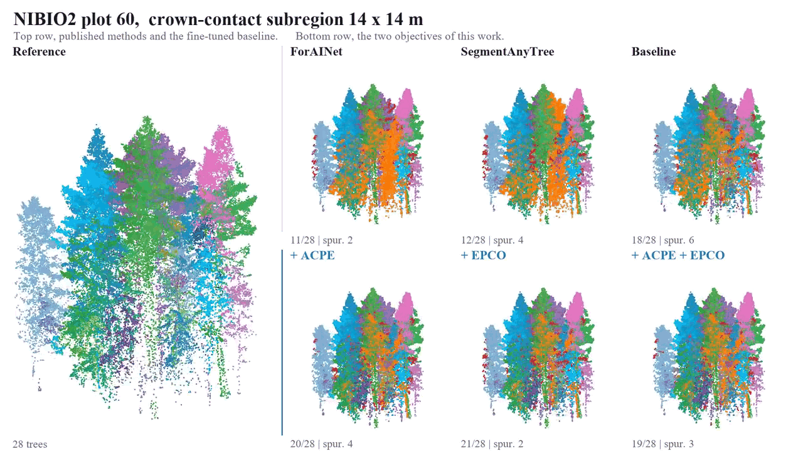

# Reliable Individual-Tree Inventory From ALS

Code release for the manuscript *Reliable Individual-Tree Inventory From Airborne Laser
Scanning With Competition-Aware Segmentation and Trait-Specific Selective Delivery*
(submitted to IEEE Transactions on Geoscience and Remote Sensing).

The repository contains the method and evaluation code, together with a short demonstration
video. It contains no point-cloud data, no model weights, no figure-generation scripts, and no
manuscript tooling.

## Demo

**Project page with the video playing in the browser: <https://harry33t.github.io/als-tree-inventory-trc/>**

`demo/comparison_nibio2_plot60.mp4` (10 s, 720p) rotates one crown-contact subregion of
14 x 14 m through the seven panels of the qualitative figure of the article. The manual
reference stands on the left. The top row holds the published methods and the fine-tuned
baseline, ForAINet, SegmentAnyTree and Baseline. The bottom row holds the three configurations
of this work, +ACPE, +EPCO and +ACPE+EPCO. Points are coloured by the reference tree that a
predicted instance is matched to; gray is a spurious instance, orange a reference tree without
an accepted match, red the points of a neighbouring reference tree absorbed into a matched
instance. The counts give the matched reference trees whose centroid lies inside the subregion
and the spurious instances centred inside it. Every frame is rendered from the sealed
predictions and the sealed one-to-one matching at IoU > 0.5; nothing is recomputed.

## Contents

| Path | What it is |
|---|---|
| `acpe/run_r8_acpe_gate2_oof.py` | ACPE, the adjacent-crown prototype objective. `install_acpe_training_loss` registers the forward hook on the P2 stage of the sparse 3-D U-Net and wraps the training loss, and `build_acpe_from_capture` maps the captured features to reference-tree labels. |
| `acpe/run_r8_acpe_gate1_smoke.py` | The ACPE loss itself. `acpe_loss` implements the row-parity cross-fit, the prototypes formed from the opposite parity half, the hardest rival in feature space, and the softplus ranking with temperature `0.10`. `coarse_rows` maps fine voxels to the four-times-coarser P2 rows and `majority_labels` assigns the reference-tree label of a voxel. |
| `epco/epco.py` | EPCO, the equivalence-preserving contact-ownership objective. Group evidence by size-normalized log-mean-exp, admissible-rival selection, Gaussian contact support under stop-gradient, contact-strength-modulated temperature, and the contact-weighted ownership loss. |
| `epco/test_epco_formal.py` | Unit tests for the EPCO objective, including the query-duplication invariance of the group evidence. |
| `configs/oneformer3d_official47_*_40e.py` | The four training configurations of the paper. They differ only in `acpe_enabled`, `acpe_loss_weight`, `epco_enabled` and `epco_loss_weight`. |
| `configs/oneformer3d_*_formal_teacher.py`, `configs/oneformer3d_r8_acpe_formal.py` | The configurations inherited by the four entry configurations, and their shared parent. |
| `training/run_official47_benchmark_train.py` | Training runner for the four configurations, including the scope guards that keep the BlueCat extension source out of the training split. |
| `trc/run_source_heldout_trc.py` | Trait-specific reliability control: descriptor assembly, the three risk heads, nested leave-one-physical-source-out validation, probability calibration, risk--coverage curves, budgeted review, and the hierarchical bootstrap. |
| `trc/finalize_trc.py`, `trc/score_trc_risk_bundle.py`, `trc/extract_sealed_instance_confidence.py` | Freezing of the selected risk models, scoring of new predictions with the frozen bundle, and extraction of the inference-confidence descriptors. |
| `evaluation/evaluate_external_baselines_official28.py` | Evaluation of the external methods under the same matcher and the same inventory. |
| `evaluation/evaluate_l1a_external_source.py` | External-source evaluation: re-measurement of sealed predictions with the frozen trait routine and rescoring with the frozen risk models. |

The configuration that the article calls Baseline is named `control` in the code and in the
run logs. File names and contents are kept as they were run.

## Frozen settings

ACPE acts on the 96-dimensional, l2-normalized P2 voxel features, which are four times
coarser than the input voxels. A tree is eligible when both parity halves hold at least 16
voxels, and a crop needs at least two eligible trees. The ranking loss uses temperature
`T = 0.10` and no margin, with weight `alpha = 0.10`.

EPCO acts on the final decoder layer. Contact kernel `sigma_xy = 0.60 m`, support threshold
`0.05`, at most `4096` contact voxels per target tree, suppressed-rival logit `-20`,
temperature `tau = 1.50 - 0.75 w`, weight `beta = 0.10`. The support term is computed under a
stop-gradient, so gradients reach the network only through the evidence terms of the
ownership competition.

Both objectives are auxiliary losses, `L_total = L_FF3D + alpha * L_ACPE + beta * L_EPCO`.
They are active during training only and are removed at inference, so the deployed network
is the unmodified segmenter graph.

## Relation to the upstream segmenter

Both objectives are written for ForestFormer3D, which builds on OneFormer3D and
MMDetection3D. Neither ForestFormer3D nor OneFormer3D source files are redistributed here.
Obtain them from their own releases. ACPE attaches itself through the hook in
`install_acpe_training_loss`, and EPCO is called once per training sample from the instance
criterion after the final decoder layer has produced its mask logits. This is a code
extraction rather than a complete runnable environment.

## Citation

Please cite the article once it appears. Until then, cite this repository and the
FOR-instanceV2 benchmark.
